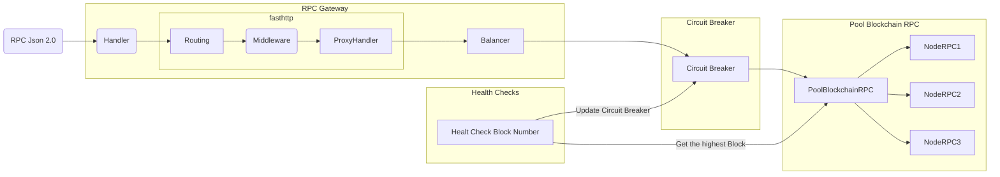
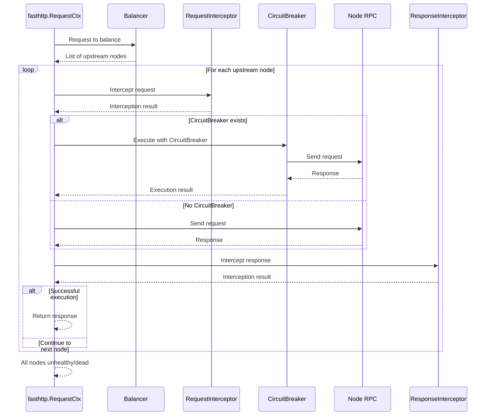

# Gateway Architecture

For now, the gateway only support RPC Json 2.0 and not support websocket (may be in the future).
The Request will be sent to the RPC Gateway. The request will be routed to the right proxy handler. The proxy handler will be sent to the right node RPC depend on the load balancer algorithm. The node RPC will send the response to the gateway. The gateway will send the response to the client.

Each load balancer have its own proxy handler.

| Load Balancer       | Proxy Handler  | Description |  
|---------------------|----------------|-------------|
| Weight-Round-Robin  | Default        | Distributes requests to upstream servers based on their weights. Each server is assigned a weight, and the load balancer cycles through the servers, sending more requests to servers with higher weights. |
| Least-Loaded        | Default        | Routes requests to the server with the least current load. This strategy helps in balancing the load more evenly across servers. |
| None-Concurrent     | Concurrent     | Ensures that requests are handled concurrently, optimizing for scenarios where multiple requests need to be processed simultaneously. |
| Failover-Priority   | Failover       | Routes requests to the server with the highest priority. This strategy helps in ensuring high availability and failover support. |

This is the sequence diagram of the proxy handler.

In the proxy handler, the request will be sent to the balancer for get the list of node RPC depend on the load balancer algorithm. Then the request will be intercept. will sent to the circuit breaker for check the circuit breaker status. If the circuit breaker is open, it will return the error to the client. If the circuit breaker is closed, it will sent to right node RPC for get the response.